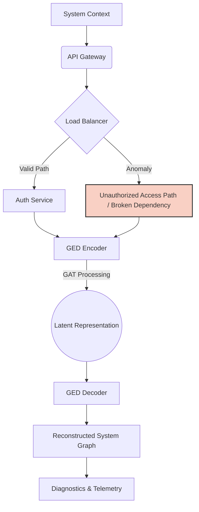

# Graph Encoder-Decoder (GED) Foundation

Welcome to the Graph Encoder-Decoder (GED) Foundation project. This repository contains the core neural assets for identifying and reconstructing complex system architectural patterns, including broken dependency chains and unauthorized access paths.

## Architecture Specs
- **Model:** GAT (Graph Attention Network)
- **Attention Heads:** 4
- **Parameters:** 28,256

## Performance Metrics
- **Accuracy:** 88.7%
- **Recall:** 99.1%
- **F1 Score:** 0.68

## System Spectrum Visualization

The following diagram illustrates the visual structural diagnostics of the system graph health, highlighting how the GED processes structural relationships and identifies structural anomalies.



## Loading Weights

To load the pre-trained foundation weights, ensure you have the required dependencies installed and use the following PyTorch loading mechanism:

```python
import torch

# Initialize your model architecture
# model = GraphEncoderDecoder(input_dim, hidden_dim, output_dim, heads=4)

# Define the path to the weights
weights_path = 'weights/ged_foundation.pth'

# Load the state dictionary
state_dict = torch.load(weights_path)

# Apply the weights to the model
# model.load_state_dict(state_dict)

print(f"Successfully loaded foundation weights from {weights_path}")
```

## The LLM Reasoning Bridge

The GED provides:

- **Topology Compression:** Reducing complex graphs to 32D latent vectors for token efficiency.
- **Structural Grounding:** Preventing LLM hallucinations by providing a mathematical 'source of truth' for connections.
- **Anomaly-Driven Prompting:** Injecting reconstruction error scores into the LLM context to flag risks.
